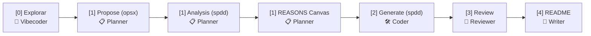

# Skill: Vibe Coding Fundamentals

Bem-vindo ao mundo do **Vibe Coding** — uma metodologia completamente nova de programação onde você colabora com GitHub Copilot Agent Mode para criar código de forma natural e iterativa.

---

## O que é Vibe Coding? 🎸

**Vibe Coding** é um paradigma de programação onde:

1. **Você descreve** o que quer em linguagem natural
2. **Copilot escreve** o código completo com inteligência
3. **Você testa e itera** para refinar o resultado
4. **O código funciona** — mesmo que você não domine cada linha

Não é sobre ignorância técnica. É sobre **leverage** — usar a IA como um colaborador especializado na sua stack.

### Princípios Fundamentais

| Princípio | Descrição |
|-----------|-----------|
| 🤝 **Colaboração** | Humano + IA trabalhando juntos |
| 🎯 **Intenção Clara** | Comunicar o que você quer, não como fazer |
| 🔄 **Iteração Rápida** | Testar, feedback, refinar, repetir |
| 📚 **Context Matters** | Bom contexto = melhor código |
| 🛡️ **Confiança Verificada** | Sempre revisar e testar |

---

## GitHub Copilot Agent Mode 🤖

### O que é?

**Agent Mode** é o modo avançado do Copilot onde ele atua como um agente *autônomo* capaz de:

- 🧠 Entender o contexto do seu projeto
- 📖 Ler e analisar múltiplos arquivos
- 🔍 Buscar informações e padrões
- 🛠️ Executar ações complexas
- 📝 Criar ou modificar código em larga escala

### Como Ativar

1. Abra VS Code
2. Pressione `Cmd + Shift + P` (macOS) ou `Ctrl + Shift + P` (Windows/Linux)
3. Digite `@mentions` ou use o símbolo `@`
4. Procure por **Agent Mode** ou use `@` para invocar agentes
5. Descreva o que você quer que o agente faça

### Diferença: Chat vs Agent Mode

```markdown
## Chat Mode (Padrão)
- Você faz pergunta
- Copilot responde
- Contexto limitado ao que você escreve

## Agent Mode ⭐
- Você descreve uma tarefa complexa
- Copilot lê múltiplos arquivos
- Copilot cria/modifica/testa automaticamente
- Contexto completo do projeto
- Executa ações iterativas
```

---

## Arquitetura de Customização 🏗️

Para implementar Vibe Coding efetivamente, você precisa de **4 camadas**:

### 1️⃣ Custom Instructions (Raiz do Projeto)

**Arquivo:** `.github/copilot-instructions.md`

Define como o Copilot deve se comportar no seu projeto:
- Linguagem e tom
- Convenções de código
- Estruturas de arquivo
- Boas práticas específicas

**Exemplo do Projeto:**
```markdown
- Responda sempre em português brasileiro
- Use MAIÚSCULAS para palavras reservadas em COBOL
- Mantenha estrutura de 4 divisões
```

👉 **Referência:** [copilot-instructions.md](../../../.github/copilot-instructions.md)

### 2️⃣ Global Agents Instructions

**Arquivo:** `AGENTS.md` (raiz do projeto)

Instruções que definem:
- Estrutura de agentes disponíveis
- Padrões de código esperados
- Regras de ouro (*Always Do*, *Never Do*)
- Convenções de nomenclatura

**Exemplo do Projeto:**
```markdown
- Use a estrutura padrão de 4 divisões
- Declare todas as variáveis na DATA DIVISION
- Termine sentenças com ponto final
```

👉 **Referência:** [AGENTS.md](../../../AGENTS.md)

### 3️⃣ Skills (Domínios Especializados)

**Pasta:** `.github/skills/`

Skills encapsulam conhecimento sobre um **domínio específico**:

#### O que é um Skill?

Um conjunto de instruções e boas práticas para um contexto específico:
- Linguagem/tecnologia
- Padrão de projeto
- Tipo de tarefa recorrente

#### Estrutura de um Skill

```
.github/skills/
├── cobol-calculadora/
│   └── SKILL.md              ← Instruções + exemplos
├── README-manutencao/
│   └── SKILL.md              ← Workflow específico
└── vibe-coding-fundamentals/
    └── SKILL.md              ← Este arquivo
```

#### Formato do SKILL.md

```yaml
---
name: nome-do-skill
description: Descrição clara do que o skill faz
---

# Skill: Nome Completo

[Conteúdo estruturado com seções claras]
```

#### Skills Disponíveis no Projeto

| Skill | Propósito | Referência |
|-------|-----------|-----------|
| **cobol-calculadora** | Criar calculadoras em COBOL | [.github/skills/cobol-calculadora/SKILL.md](.github/skills/cobol-calculadora/SKILL.md) |
| **openspec-workflow** | Governança SDLC com OpenSpec (opsx-propose, tasks, validation) | [.github/skills/openspec-workflow/SKILL.md](.github/skills/openspec-workflow/SKILL.md) |
| **openspdd-workflow** | Engenharia de prompts estruturados via REASONS Canvas (spdd-analysis, spdd-reasons-canvas, spdd-generate) | [.github/skills/openspdd-workflow/SKILL.md](.github/skills/openspdd-workflow/SKILL.md) |
| **readme-manutencao** | Manter 3 READMEs sincronizados | [.github/skills/readme-manutencao/SKILL.md](.github/skills/readme-manutencao/SKILL.md) |
| **vibe-coding-fundamentals** | Entender VibeCoding e Agent Mode | Este arquivo |
| **architecture-fitness-functions** | Fitness functions e sensores determinísticos | [.github/skills/architecture-fitness-functions/SKILL.md](.github/skills/architecture-fitness-functions/SKILL.md) |
| **agent-customization** | Criar/editar agents e customizações | `copilot-skill:/agent-customization/SKILL.md` |

### 4️⃣ Agents (Executores Autônomos)

**Pasta:** `.github/agents/`

Agentes são **especialistas** que executam tarefas complexas no SDLC:

#### Tipos de Agentes

```markdown
## Orquestração & Exploração
- COBOL Vibecoder: Conecta o fluxo ponta a ponta, explora e orquestra

## Planejamento & SDLC (OpenSpec + OpenSPDD)
- COBOL Planner: Executa opsx-propose, spdd-analysis e spdd-reasons-canvas

## Implementação & Geração Mecânica
- COBOL Coder: Executa spdd-generate, compila e passa pelos fitness gates

## Revisão & Governança
- COBOL Reviewer: Revisa código COBOL e conformidade do SDLC

## Documentação
- README Writer: Sincroniza os 3 READMEs (PT-BR, EN, ZH)
```

#### Workflow do SDLC (OpenSpec + OpenSPDD)



#### Como Invocar um Agente

```markdown
# Chat Mode
@COBOL Planner: Como estruturar uma calculadora em COBOL?

# Agent Mode (mais poderoso)
Use o seletor de agentes para invocar:
- Clique em `@` no chat
- Selecione o agente desejado
- Descreva a tarefa completa
```

👉 **Agentes Disponíveis:**
- [cobol-planner.agent.md](./../agents/cobol-planner.agent.md)
- [cobol-coder.agent.md](./../agents/cobol-coder.agent.md)
- [cobol-reviewer.agent.md](./../agents/cobol-reviewer.agent.md)
- [readme-writer.agent.md](./../agents/readme-writer.agent.md)

### 5️⃣ Prompts (Fluxos Reutilizáveis)

**Pasta:** `.github/prompts/`

Prompts são **receitas** para tarefas recorrentes:

#### Exemplos

| Prompt | Para Quê | Referência |
|--------|----------|-----------|
| criar-programa.prompt.md | Criar programa COBOL do zero | [Arquivo](./../prompts/criar-programa.prompt.md) |
| implementar-soma.prompt.md | Adicionar soma à calculadora | [Arquivo](./../prompts/implementar-soma.prompt.md) |
| testar-programa.prompt.md | Compilar e testar código | [Arquivo](./../prompts/testar-programa.prompt.md) |
| atualizar-readme.prompt.md | Sincronizar docs em 3 idiomas | [Arquivo](./../prompts/atualizar-readme.prompt.md) |

---

## Stack de Customização do cowboy 🏛️

Este projeto demonstra a stack completa governada por OpenSpec + OpenSPDD + Harness:

```
copilot-instructions.md
    ↓ Define comportamento global
AGENTS.md
    ↓ Regras gerais & Harness de fases
├── Skills/
│   ├── cobol-calculadora/
│   ├── openspec-workflow/        ← Spec-Driven Development (opsx-propose, tasks)
│   ├── openspdd-workflow/        ← REASONS Canvas (analysis, canvas, generate)
│   ├── readme-manutencao/
│   └── vibe-coding-fundamentals/
│       ↓ Conhecimento de domínio
├── Agents/
│   ├── cobol-vibecoder.agent.md  ← [0] Explorar & Orquestrar
│   ├── cobol-planner.agent.md    ← [1] Propose (opsx) + Analysis & Canvas (spdd)
│   ├── cobol-coder.agent.md      ← [2] Generate & Implementar (spdd-generate)
│   ├── cobol-reviewer.agent.md   ← [3] Revisar Código & Rastreabilidade SDLC
│   └── readme-writer.agent.md    ← [4] Sincronizar Documentação
│       ↓ Executores especializados
└── Prompts/
    ├── criar-programa.prompt.md
    ├── implementar-soma.prompt.md
    ├── sdlc.prompt.md
    └── ...
        ↓ Receitas recorrentes
```

---

## Workflow Prático: SDLC com OpenSpec + OpenSPDD 🎬

### Trilha Operacional:
`[0] explorar -> [1] propose -> [1] analysis -> [1] reasons-canvas -> [2] generate`

#### Passo 0: Exploração (`cobol-vibecoder`)
```
Usuário: @COBOL Vibecoder
         Quero adicionar cálculo de módulo (resto da divisão) na calculadora.

Vibecoder: [Explora codebase e requisitos]
           [Define change: adicionar-modulo]
           [Aciona o COBOL Planner passando a proposta]
```

#### Passo 1: Propose & Planejamento (`cobol-planner`)
```
Planner: [Executa opsx-propose: cria openspec/changes/adicionar-modulo/]
         [Executa spdd-analysis: gera spdd/analysis/COB-002-...-[Analysis]-modulo.md]
         [Executa spdd-reasons-canvas: gera spdd/prompt/COB-002-...-[Code]-modulo.md]
         [Aciona o COBOL Coder com a rota do canvas]
```

#### Passo 2: Geração & Implementação Mecânica (`cobol-coder`)
```
Coder: [Promove fase do harness: phase_cli.py set apply adicionar-modulo]
       [Executa spdd-generate lendo o REASONS Canvas]
       [Edita src/CALCULADORA.cbl respeitando colunas 8-11 e 12-72]
       [Compila: cobc -x -o calculadora src/CALCULADORA.cbl]
       [Roda sensores: make fitness (13/13 OK)]
       [Atualiza tasks.md e valida com openspec validate --strict]
       [Aciona COBOL Reviewer]
```

#### Passo 3: Revisão (`cobol-reviewer`)
```
Reviewer: [Analisa boas práticas de COBOL e conformidade do SDLC]
          [Valida 100% de passagem nos fitness gates]
          [Aciona README Writer]
```

#### Passo 4: Documentação (`readme-writer`)
```
Writer: [Sincroniza os 3 READMEs (PT-BR, EN e ZH)]
        [Registra a nova operação de módulo]
```

---

## Boas Práticas para Vibe Coding ✅

### DO's (Faça)

✅ **Descrição Clara**
```markdown
BOM: "Crie uma calculadora que soma, subtrai, multiplica e divide dois números inteiros de 5 dígitos"
RUIM: "Faz uma calc"
```

✅ **Context Completo**
```markdown
BOM: Use o skill cobol-calculadora e siga AGENTS.md
RUIM: Só escreve o código
```

✅ **Revisar o Resultado**
```markdown
Sempre verifique:
- Compila sem erros?
- Executa corretamente?
- Segue as conventions?
```

✅ **Usar Skill Apropriado**
```markdown
Tarefa com COBOL → cobol-calculadora
Tarefa com README → readme-manutencao
Tarefa nova → vibe-coding-fundamentals
```

### DON'Ts (Não Faça)

❌ **Confiar Cegamente**
```markdown
ERRADO: Copiar e colar sem revisar
CORRETO: Revisar, testar e validar tudo
```

❌ **Ignorar Convenções**
```markdown
ERRADO: "Ignora AGENTS.md, faz do teu jeito"
CORRETO: "Segue rigorosamente AGENTS.md"
```

❌ **Context Vago**
```markdown
ERRADO: "Cria um programa"
CORRETO: "Cria um programa COBOL que calcula logaritmo base 10"
```

---

## Mapa Mental do Projeto 🧠

```
cowboy/
│
├── 📖 README.md / README-en.md / README-zh.md
│   └── Documentação principal (3 idiomas)
│
├── 🏗️ AGENTS.md
│   └── Regras globais, estrutura COBOL
│
├── 📚 .github/copilot-instructions.md
│   └── Instruções Copilot específicas
│
├── 🧠 .github/skills/
│   ├── cobol-calculadora/
│   │   └── Como criar calculadoras
│   ├── readme-manutencao/
│   │   └── Como manter docs sincronizadas
│   └── vibe-coding-fundamentals/
│       └── Este skill → Conceitos e arquitetura
│
├── 🤖 .github/agents/
│   ├── cobol-planner.agent.md
│   │   └── Planeja sem fazer mudanças
│   ├── cobol-coder.agent.md
│   │   └── Escreve e compila
│   ├── cobol-reviewer.agent.md
│   │   └── Revisa código
│   ├── readme-writer.agent.md
│   │   └── Mantém docs
│   └── cobol-vibecoder.agent.md
│       └── Orquestra tudo
│
├── 📝 .github/prompts/
│   ├── criar-programa.prompt.md
│   ├── implementar-soma.prompt.md
│   ├── implementar-subtracao.prompt.md
│   ├── implementar-divisao.prompt.md
│   ├── implementar-log.prompt.md
│   ├── testar-programa.prompt.md
│   ├── atualizar-readme.prompt.md
│   └── manutencao-repositorio.prompt.md
│
└── 💻 src/
    └── CALCULADORA.cbl
        └── Programa compilável
```

---

## Casos de Uso para Este Skill 🎯

### Use Este Skill Quando:

1. **Entender Vibe Coding**
   - "O que é Vibe Coding?"
   - "Como funciona Agent Mode?"
   - "Por que usar Skills?"

2. **Configurar Novo Projeto**
   - "Como estruturar customizações de Copilot?"
   - "Qual é a hierarquia de Skills, Agents, Prompts?"
   - "Como criar um SKILL.md novo?"

3. **Troubleshooting de Customizações**
   - "Por que meu Agent não está sendo reconhecido?"
   - "Como adicionar um novo Skill?"
   - "Qual é a ordem correta de execução?"

4. **Aprender Best Practices**
   - "Como escrever bons prompts?"
   - "Quando usar cada agente?"
   - "Como estruturar um Skill efetivo?"

### NÃO Use Este Skill Para:

❌ Implementação COBOL específica → Use **cobol-calculadora**
❌ Manutenção de READMEs → Use **readme-manutencao**
❌ Revisar código produzido → Use **COBOL Reviewer Agent**
❌ Troubleshooting de compilação → Use **COBOL Coder Agent**

---

## Referências Cruzadas 📚

### Documentação Principal

- [README.md](../../../README.md) — Visão geral do projeto
- [AGENTS.md](../../../AGENTS.md) — Especificações técnicas e regras

### Copilot Instructions

- [.github/copilot-instructions.md](./../copilot-instructions.md) — Como Copilot deve se comportar

### Skills Relacionados

- [cobol-calculadora/SKILL.md](./../skills/cobol-calculadora/SKILL.md) — Criar calculadoras em COBOL
- [readme-manutencao/SKILL.md](./../skills/readme-manutencao/SKILL.md) — Manter docs sincronizadas
- [agent-customization](copilot-skill:/agent-customization/SKILL.md) — Criar/editar customizações

### Agents Especializados

- [cobol-planner.agent.md](./../agents/cobol-planner.agent.md) — Planejador
- [cobol-coder.agent.md](./../agents/cobol-coder.agent.md) — Programador
- [cobol-reviewer.agent.md](./../agents/cobol-reviewer.agent.md) — Revisor
- [cobol-vibecoder.agent.md](./../agents/cobol-vibecoder.agent.md) — Orquestrador
- [readme-writer.agent.md](./../agents/readme-writer.agent.md) — Documentador

### Prompts Reutilizáveis

- [criar-programa.prompt.md](./../prompts/criar-programa.prompt.md)
- [implementar-soma.prompt.md](./../prompts/implementar-soma.prompt.md)
- [implementar-subtracao.prompt.md](./../prompts/implementar-subtracao.prompt.md)
- [implementar-divisao.prompt.md](./../prompts/implementar-divisao.prompt.md)
- [implementar-log.prompt.md](./../prompts/implementar-log.prompt.md)
- [testar-programa.prompt.md](./../prompts/testar-programa.prompt.md)
- [atualizar-readme.prompt.md](./../prompts/atualizar-readme.prompt.md)
- [manutencao-repositorio.prompt.md](./../prompts/manutencao-repositorio.prompt.md)

---

## Próximos Passos 🚀

Depois de entender este Skill:

1. **Leia** [AGENTS.md](../../../AGENTS.md) para ver as regras globais
2. **Explore** [.github/copilot-instructions.md](./../copilot-instructions.md) para entender comportamento
3. **Estude** [cobol-calculadora/SKILL.md](./../skills/cobol-calculadora/SKILL.md) como exemplo prático
4. **Invoque** um agente com uma tarefa real (use `@COBOL Planner` primeiro!)
5. **Crie** seu próprio Skill seguindo este template

---

## Lembre-se 💭

> "Vibe Coding não é preguiça — é **leverage**. Você está colaborando com um especialista de IA para escribir código melhor, mais rápido e com menos erros."

```
🤠 cowboy
   "Vibe Coding é programar sem entender o código"
   
   ↓
   
   Espera, não...
   
   ↓
   
   "Vibe Coding é programar COM IA como seu par,
    focando na intenção e qualidade ao invés
    de cada linha de sintaxe."
```

---

## Versão

- **Vibe Coding Fundamentals Skill**: v1.0
- **Data**: 28 de março de 2026
- **Compatível com**: GitHub Copilot Agent Mode
- **Linguagem**: Português Brasileiro (PT-BR)

