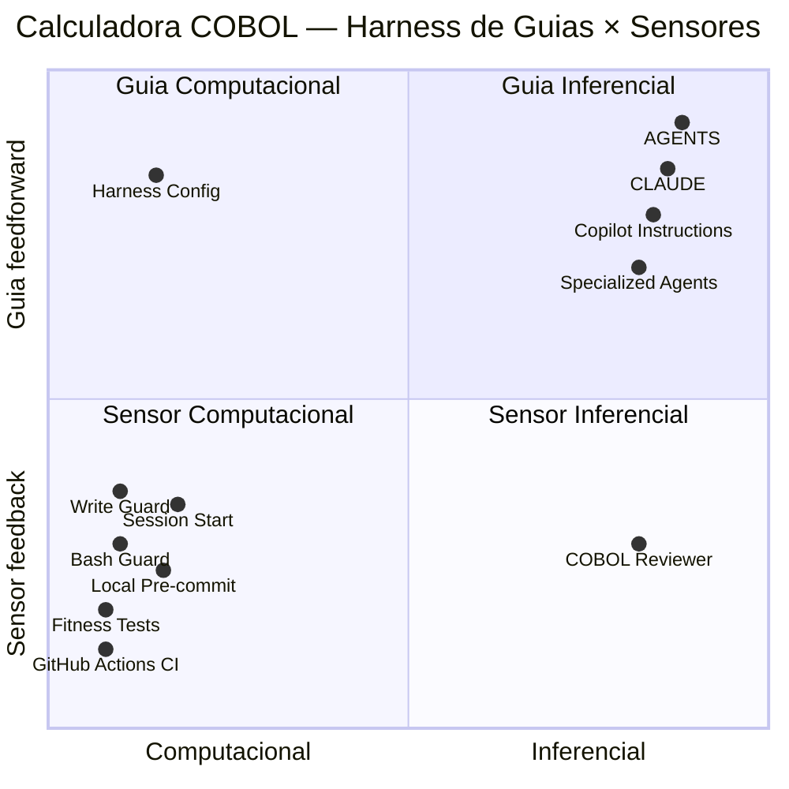

# Calculadora COBOL — Análise de Harness por Quadrante Guias × Sensores

## Metodologia

Esta avaliação classifica artefatos verificáveis do repositório conforme dois
eixos: X, de computacional a inferencial; Y, de sensor de feedback a guia
feedforward. Coordenadas são qualitativas e servem apenas para priorização.
Cada ponto do diagrama tem uma justificativa e um arquivo-fonte na tabela de
rastreabilidade.

## Notas do Harness

- **Data da avaliação**: 2026-10-03
- **Escopo**: harness de desenvolvimento do repositório `emilianoeloi/cowboy`
- **Confiança**: média — guias, configuração, hooks e workflow foram
  inspecionados e `make fitness` foi executado; hooks não foram exercitados
  com payloads adversariais nem o workflow remoto foi executado.

### Nota de eficácia: 7,0/10

Média das cinco dimensões conhecidas: `(4 + 4 + 3 + 3 + 3,5) / 5 × 2 = 7,0`.

| Dimensão | Pontuação (0–5) | Evidência (arquivo-fonte) | Justificativa |
|---|---:|---|---|
| Clareza das guias | 4 | [AGENTS.md](../AGENTS.md), [copilot-instructions.md](../.github/copilot-instructions.md), [harness.config.json](../harness.config.json) | Convenções, comandos e limites são explícitos; há divergência entre a exigência de declarar fase e o comportamento permissivo quando o estado não existe. |
| Automação | 4 | [pre-tool-write-guard.py](../scripts/hooks/pre-tool-write-guard.py), [pre-tool-bash-guard.py](../scripts/hooks/pre-tool-bash-guard.py), [ci.yml](../.github/workflows/ci.yml) | Existem hooks, CLI de fase, fitness functions e CI; parte do gate é fail-open e os testes não cobrem diretamente o comportamento dos hooks. |
| Cobertura de feedback | 3 | [test_cobol_architecture.py](../tests/fitness/test_cobol_architecture.py), [ci.yml](../.github/workflows/ci.yml) | CI cobre arquitetura, sintaxe, compilação e smoke test; não executa `make test-unit` nem testa as fronteiras de segurança dos hooks. |
| Rastreabilidade/evolução | 3 | [phase_cli.py](../scripts/harness/phase_cli.py), [cobol-reviewer.agent.md](../.github/agents/cobol-reviewer.agent.md), [ci.yml](../.github/workflows/ci.yml) | Há estado de fase e revisão descrita, mas não foram encontrados testes automatizados dos guardrails; as instruções do agente revisor divergem sobre executar verificações. |
| Adoção/baixo atrito | 3,5 | [Makefile](../Makefile), [settings.json](../.claude/settings.json), [ci.yml](../.github/workflows/ci.yml) | Há comandos Make e configuração dos hooks; a instalação local depende de `make init-hooks` e GnuCOBOL é necessário para todos os gates funcionais locais. |

### Nota de complexidade/tamanho: 6/10 (médio)

- **Evidência**: três guias principais, configuração declarativa, três hooks,
  CLI de fase, fitness functions, hook Git local, agentes, skills, prompts e
  workflow de CI. O número de componentes integrados eleva manutenção, embora
  os sensores Python usem a biblioteca padrão.

### Limitações e próximos passos

- **Limitações**: avaliação estática dos hooks e do workflow; não houve
  execução de CI remoto, revisão de PR nem teste de isolamento de caminhos.
- **Próximos passos**: cobrir com testes os estados ausente/inválido da fase e
  os limites de caminho; alinhar o gate com a regra de fase declarada; executar
  a suíte unitária completa na CI.

## Contexto de Mercado

| Fonte | Data/versão | Prática observada | Evidência | Aplicabilidade | Aderência do repositório |
|---|---|---|---|---|---|
| Contexto de mercado não verificado nesta avaliação — nenhuma fonte externa identificada. | — | — | — | — | — |

A nota interna deste relatório não equivale a uma média estatística do mercado.

## Diagrama

## Rastreabilidade

| Ponto | Arquivo-fonte | Quadrante | Justificativa |
|---|---|---|---|
| AGENTS | [AGENTS.md](../AGENTS.md) | Guia Inferencial | Orienta o agente antes da implementação com convenções COBOL, comandos e quality gates. |
| CLAUDE | [CLAUDE.md](../CLAUDE.md) | Guia Inferencial | Declara fonte de verdade, regras operacionais e gates para o harness Claude. |
| Copilot Instructions | [copilot-instructions.md](../.github/copilot-instructions.md) | Guia Inferencial | Fornece instruções e exemplos em linguagem natural para o Copilot. |
| Specialized Agents | [cobol-coder.agent.md](../.github/agents/cobol-coder.agent.md) | Guia Inferencial | Agentes especializados descrevem papéis e procedimentos para planejamento, implementação e documentação. |
| Harness Config | [harness.config.json](../harness.config.json) | Guia Computacional | Prefixos, arquivos de guias e padrões de bloqueio alimentam os hooks sem interpretação humana. |
| Write Guard | [pre-tool-write-guard.py](../scripts/hooks/pre-tool-write-guard.py) | Sensor Computacional | Avalia automaticamente caminhos, nomes de arquivos e fase antes de operações de escrita. |
| Bash Guard | [pre-tool-bash-guard.py](../scripts/hooks/pre-tool-bash-guard.py) | Sensor Computacional | Compara comandos com padrões de bloqueio e recusa comandos proibidos. |
| Fitness Tests | [test_cobol_architecture.py](../tests/fitness/test_cobol_architecture.py) | Sensor Computacional | Testes determinísticos verificam seis regras estruturais e incluem fixtures negativas. |
| Local Pre-commit | [pre-commit](../scripts/git-hooks/pre-commit) | Sensor Computacional | Quando instalado, roda fitness tests e, se GnuCOBOL estiver disponível, valida sintaxe e testes unitários antes do commit. |
| GitHub Actions CI | [ci.yml](../.github/workflows/ci.yml) | Sensor Computacional | Executa gates em pushes e pull requests para `main`; inclui fitness, sintaxe, build e smoke test. |
| Session Start | [session-start.py](../scripts/hooks/session-start.py) | Sensor Computacional | Na inicialização, informa branch, fase e presença dos guias configurados. |
| COBOL Reviewer | [cobol-reviewer.agent.md](../.github/agents/cobol-reviewer.agent.md) | Sensor Inferencial | Propõe avaliação semântica do código e da conformidade; depende de o agente ser invocado e contém instruções parcialmente conflitantes sobre executar verificações. |

## Lacunas priorizadas

| # | Lacuna | Risco | Próximo passo |
|---|---|---|---|
| 1 | O write guard usa `str(resolved).startswith(str(repo_root))` para verificar contenção; um caminho externo cujo nome apenas compartilhe o prefixo da raiz pode passar pela verificação. | Alto | Substituir a comparação textual por verificação de ancestralidade de caminhos e adicionar testes para caminhos irmãos com prefixo comum, traversal e caminho interno. |
| 2 | Estado de fase ausente, inválido ou configuração ausente/corrompida não ativa o bloqueio de `proposal`; a escrita fica permitida, apesar da orientação operacional de declarar a fase. | Alto | Definir comportamento fail-closed para operações de código e testar estado ausente, malformado e fase não reconhecida nos dois hooks. |
| 3 | O workflow executa smoke test, mas não `make test-unit`; também não há testes dedicados aos hooks e seus casos de segurança. | Médio | Adicionar a suíte unitária e testes de contrato para os hooks ao workflow de CI. |
| 4 | O agente revisor determina execução de verificações em algumas seções, mas afirma em outra que não executa comandos. | Baixo | Alinhar as instruções do agente para separar claramente inspeção, execução de testes e relato de resultados efetivamente observados. |

## Próximas ações recomendadas

1. Corrigir e testar a verificação de contenção de caminhos no write guard.
2. Tornar explícito e testado o comportamento do gate quando fase/configuração
   estão ausentes ou inválidas.
3. Incluir testes unitários e testes dos hooks no workflow de CI.
